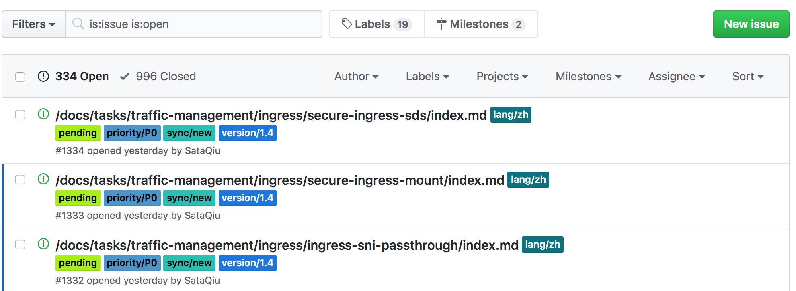

# Istio官方文档翻译指导手册

## 概要

去年我们社区组织翻译了Istio的1.2版本，随着Istio版本的快速迭代，老版本有许多需要更新的地方。为了让国内对Istio感兴趣的工程师可以学习到最新的官方文档，我们打算重启翻译工作，并基于官方的主线分支进行翻译，保证每次Istio在发布新版本时，同步的发布中文文档。

感谢您加入我们的翻译团队，并为Istio的中文化工作作出贡献。本篇文档是帮助您进行高效翻译的指导手册，建议您在正式翻译前认真阅读。

## 基本流程

整个翻译的基本流程包括下面几个步骤：

- 任务领取：在本仓库的Issue页面领取待翻译的任务；
- 翻译：根据任务提示进行翻译工作；
- 提交：翻译人员提交PR等待review；
- 校对：其他翻译人员对当前任务进行review；
- 终审：管理员团队对翻译内容进行最后确认；
- 预览：和源文档进行比对，查看显示效果；
- 合并：merge进入官方仓库，任务结束。

我们通过校对、终审两轮review保证翻译的质量；通过预览保证显示的准确性。翻译人员在整个流程中需要做的是领取任务，翻译，提交PR，预览自查这几步。

## 翻译指南

下面具体介绍一下如何进行翻译工作。

### 准备工作

- 报名：[请先在这里报名](https://docs.google.com/spreadsheets/d/1zHDiXHsRD2sc3UWClTPzXTBcTSuEdRbf1tTj4AdTE3o/edit)，填写基本信息（姓名、微信、Github账号）。
- 账号：您需要准备一个微信号、钉钉号、GitHub账号。报名后，管理员会将您分别添加到翻译工作组的微信群、钉钉群和ServiceMesher的GitHub组织。
- 为保证翻译的统一性和准确性，请在翻译前仔细阅读术语表
  - 常用词汇表：对常见的技术词汇给出统一的翻译；
  - 术语表：文档中出现的专有技术名词，关键词，**保持原文不翻译；**

### 翻译流程

#### Step1：任务浏览

访问[任务列表](https://github.com/servicemesher/istio-official-translation/issues)，会看到如下图所示的待领取任务：

**状态label：**

- pending：待领取的任务；
- translating：已经有人领取，正在翻译的任务；
- pushed：已翻译并生成PR，正在进行review；
- merged：PR已合并，任务完成。

**优先级label：**

- 优先级从高到低分别为priority/P0 ~ priority/P3。优先选择优先级高的进行翻译。

可以简单的通过点击标签来进行过滤。也可以参考 [github 查询语法](https://help.github.com/articles/searching-issues-and-pull-requests/)，来完成更复杂的查询。

#### Step2：任务领取

找到未经认领的任务（pending状态），在 issue 中回复 `/accept` 可以领取任务，Bot会将任务分配给你，并修改状态为translating。

> 注意：同一译者，只能保持三个 `translating` 状态的 Issue，超过数量无法继续认领。

#### Step3：翻译

- 请随时参考[约定和术语表](https://github.com/servicemesher/istio-official-translation/issues/77)，若对某些词汇的翻译模棱两可，可以直接回复该 Issue，或者在微信群请求帮助。

- 文档由若干 `md` 和 `html` 文档构成，将issue中给出的原始文件复制一份到对应中文目录下进行翻译。

- 译文中的英文与中文建议用空格分隔,可以使用这个[自动化中英文格式化 md 的软件](https://pypi.org/project/zhlint/)。
- 对于长文章翻译要注意锚点链接不要移除，例如 `[Server](#Client)` 翻译成 `[服务器](#Client)` 锚点链接保留，但不翻译。
- `md` 代码块与代码输出内容不要翻译。
- 对于翻译文稿中涉及到的静态文件，直接沿用英文版的文件（例如 ``），不再需要自行拷贝。

#### Step4：本地构建

//todo

#### Step5：校对（review）

校对工作由没有翻译过当前文档的其他翻译人员执行，即翻译人员互为校对人员。为保证质量，我们设置了两轮Review：

所有翻译人员互为校对人员，分配一个翻译任务同时要确定校对任务；

- 初审：负责对翻译的内容和原文较为精细的进行对比，保证语句通顺，无明显翻译错误；
- 终审：负责对翻译的文档做概要性的检查，聚焦在行文的通顺性、一致性、符合中文语言习惯，词汇、术语准确。终审通过后由管理员approve当前PR，就可以进行合并了。

**参与Review**：所有 istio.io 的 PR都会通过 Github 机器人同步在钉钉群里，如果看到感兴趣的 PR 就在[本项目](https://github.com/servicemesher/istio-official-translation)中对应的 issue 回复一下，我们社区的 maintainer 会通过 `/assign`命令手动将Review工作指派给您。

#### Step6：任务完成

通过终审后的任务会被管理员approve，并合并到Istio的官方仓库中。需要您在对应的 Issue 中输入指令 `/merged`，Bot 会设置 Issue 的状态为 `finished`，并关闭 Issue。整个翻译任务就算正式完成了。您可以继续领取新的任务进行翻译，或参与校对工作。

## FAQ

## 感谢!

感谢您的辛勤付出！相信在大家共同的努力下Istio和Service Mesh技术会更加蓬勃的发展！